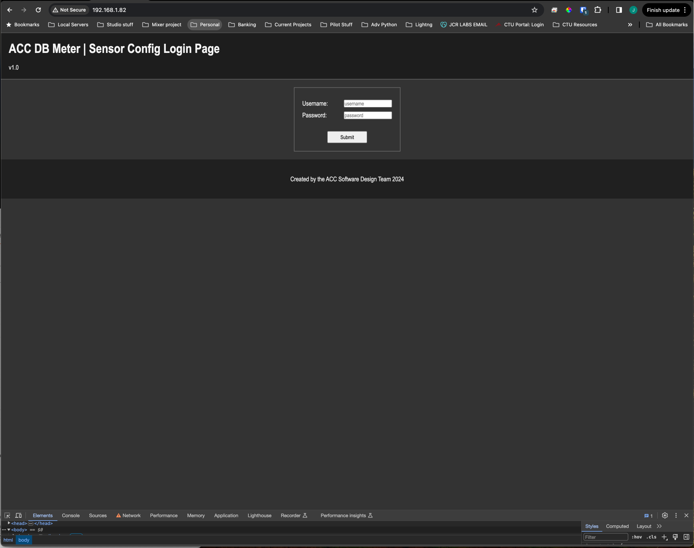

[![Contributors][contributors-shield]][contributors-url]
[![Forks][forks-shield]][forks-url]
[![Stargazers][stars-shield]][stars-url]
[![Issues][issues-shield]][issues-url]
[![MIT License][license-shield]][license-url]
[![LinkedIn][linkedin-shield]][linkedin-url]

<br />
<div align="center">
  <a href="https://github.com/SR-Coder/accDbMeter">
    
  </a>

  <h3 align="center">ACC dB Meter</h3>

  <p align="center">
    A multi-station decibel monitoring system built with React, Mosquitto MQTT, and MicroPython/C++.
    <br />
    <a href="https://github.com/SR-Coder/accDbMeter/issues">Report Bug</a>
    &nbsp;·&nbsp;
    <a href="https://github.com/SR-Coder/accDbMeter/issues">Request Feature</a>
  </p>
</div>

---

## About

ACC dB Meter is a real-time audio level monitoring system designed for multi-venue or multi-zone environments. Wireless sensors measure ambient decibel levels and publish readings over MQTT. A React dashboard subscribes to the broker and displays live per-sensor gauges, VU bars, and historical charts — all colour-coded by dB zone.

**Sensors** publish to a Mosquitto MQTT broker over Wi-Fi. The **React client** connects via WebSocket and renders a card per sensor, updating in real time.

---

## Built With

* [![React][React.js]][React-url] + [Vite](https://vitejs.dev)
* [![Mosquitto][mosquittoB]][mosquitto-url]
* [![Micropython][micropython.dev]][micropython-url] (Raspberry Pi Pico W)
* [Arduino / PlatformIO](https://platformio.org) (ESP32-S3)

---

## Architecture

```
Sensor (Pico W / ESP32-S3)
  └─ Wi-Fi ──► Mosquitto broker  (port 1885, MQTT)
                      │
                      └─ WebSocket (port 8885) ──► React client (browser)
```

Each sensor publishes a JSON message to the `DBMeter` topic:

```json
{
  "sensorId": 57243727616732,
  "sensorName": "Back of Church",
  "dbLevel": 74,
  "timestamp": 1708206580764
}
```

---

## Getting Started

### Prerequisites

- [Docker](https://docs.docker.com/get-docker/) — for the broker and client
- [Node.js 20+](https://nodejs.org) — for local development only
- A flashed Raspberry Pi Pico W or ESP32-S3 with the sensor firmware

### Running with Docker

The recommended way to run the full stack is via Docker.

**1. Mosquitto broker**

```sh
docker run -d \
  --name mosquitto \
  --network br0 \
  -v /path/to/appdata/mosquitto/config:/mosquitto/config \
  eclipse-mosquitto:2
```

The config at `/mosquitto/config/mosquitto.conf` should define two listeners:

```
listener 1885 0.0.0.0
allow_anonymous true

listener 8885 0.0.0.0
protocol websockets
allow_anonymous true
```

**2. React client**

```sh
# From the repo root
docker build -t acc-dbmeter-client:latest ./dbMeterClient
docker run -d \
  --name acc-dbmeter-client \
  --network br0 \
  acc-dbmeter-client:latest
```

The client is then available at the container's assigned IP on port 80.

### Local Development

```sh
cd dbMeterClient
cp .env.sample .env.local
# Edit .env.local — set VITE_MQTT_URL to your broker's WebSocket address
npm install
npm run dev
```

---

## Sensor Configuration

See [`sensor/README.md`](sensor/README.md) for firmware setup and initial Wi-Fi provisioning.

Once a sensor is on the network, browse to its IP address to configure:
- **MQTT broker address and port** (default port: `1885`)
- **Sensor name** displayed on the dashboard
- **Publish rate**

---

## Roadmap

- [x] React + Vite front-end client
- [x] Sensor firmware — Raspberry Pi Pico W (MicroPython)
- [x] Sensor firmware — ESP32-S3 (Arduino / PlatformIO)
- [x] Mosquitto MQTT broker integration
- [x] Multi-station real-time dB visualisation
- [x] Docker deployment
- [x] Dark mode UI with dynamic VU bar and colour-coded gauges
- [ ] Location map (Leaflet / OpenStreetMap)
- [ ] Authentication for sensor configuration dashboard

---

## Contributing

1. Fork the repository
2. Create a feature branch (`git checkout -b feature/my-feature`)
3. Commit your changes
4. Push to the branch (`git push origin feature/my-feature`)
5. Open a pull request

---

## License

Distributed under the MIT License. See [`LICENSE.txt`](LICENSE.txt) for details.

---

## Contact

Jim Reeder — info@jcrlabs.com

Project: [https://github.com/SR-Coder/accDbMeter](https://github.com/SR-Coder/accDbMeter)

---

[contributors-shield]: https://img.shields.io/github/contributors/SR-Coder/accDbMeter.svg?style=for-the-badge
[contributors-url]: https://github.com/SR-Coder/accDbMeter/graphs/contributors
[forks-shield]: https://img.shields.io/github/forks/SR-Coder/accDbMeter.svg?style=for-the-badge
[forks-url]: https://github.com/SR-Coder/accDbMeter/network/members
[stars-shield]: https://img.shields.io/github/stars/SR-Coder/accDbMeter.svg?style=for-the-badge
[stars-url]: https://github.com/SR-Coder/accDbMeter/stargazers
[issues-shield]: https://img.shields.io/github/issues/SR-Coder/accDbMeter.svg?style=for-the-badge
[issues-url]: https://github.com/SR-Coder/accDbMeter/issues
[license-shield]: https://img.shields.io/github/license/SR-Coder/accDbMeter.svg?style=for-the-badge
[license-url]: https://github.com/SR-Coder/accDbMeter/blob/master/LICENSE.txt
[linkedin-shield]: https://img.shields.io/badge/-LinkedIn-black.svg?style=for-the-badge&logo=linkedin&colorB=555
[linkedin-url]: https://linkedin.com/in/james-reeder-55582366/
[mosquitto-url]: https://mosquitto.org/
[mosquittoB]: https://mosquitto.org/images/mosquitto-text-side-28.png
[micropython.dev]: https://micropython.org/static/img/Mlogo_138wh.png
[micropython-url]: https://micropython.org
[React.js]: https://img.shields.io/badge/React-20232A?style=for-the-badge&logo=react&logoColor=61DAFB
[React-url]: https://reactjs.org/
